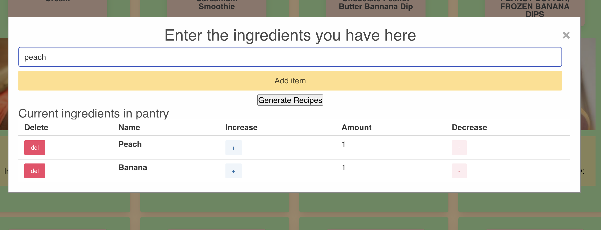
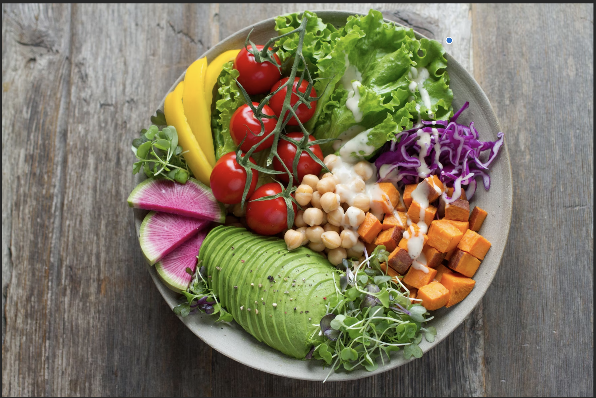

# Dynamic-Cookbook
Dynamic-Cookbook is a food resource designed to help users create delicious meals using the ingredients they already have in their pantry. The app suggests recipes based on pantry. It also suggests recipes that need some additional ingredients so users have various recipe options. Users can also create a shopping list , located on the top-left header, in case they need. 

Food is essential to sustain our bodies. Cooking food everyday, however, is a struggle to many. Our hope with this app is to make users lives a little easier by creating recipes with what they have in their pantry that way they do not have to come up with ideas for meals per meal. 

# Technologies
- HTML
- CSS
- JavaScript
- Jquery
- Granim.js
- Bulma.io
- Spponacular (API)
- Edamam (API)

# Deployed Link and URL

- https://alenambo02.github.io/dynamic-cookbook/
- https://github.com/alenambo02/dynamic-cookbook

# Significant Code Snippets

``` 
$(document).on("click", "#addItemBtn", function (event) { //Add ingredient listener
    var itemVal = $(this).siblings("input").val()
    if (itemVal != "") { //Simple validation for if any input at all
        var itemCheckUrl = "https://api.edamam.com/auto-complete?app_id=fd3763f8&app_key=4577463150cadf088b2a86813ab799da&q=" + itemVal + "&limit=5"
        $.ajax({ //Fetch validation. Call api to see if an ingredient exsists with the name of the input
            url: itemCheckUrl,
            method: "GET"
        })
            .then(function (response) {
                console.log(response)
                if (response.length > 0) { //Real items will return an array with at least 1 element
                    //console.log("real ingredient")
                    addPantryIngredient(response[0].charAt(0).toUpperCase() + response[0].slice(1))
                } else { //Fake items will return an empty array
                    fakeItemAlert() //Notify user that it is a fake ingredient
                }
            })
    }
})

```

# Screen Shots for Design Highlight





# Gif for Demoing Functionality


# Contributors

- Harshith Manjunatha
- Alejandra Izquierdo 
- Priya Rizal 


# License

- MIT
