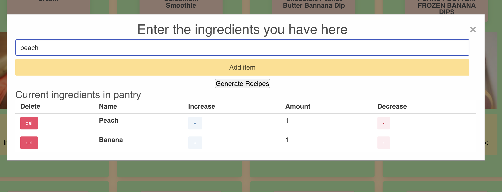
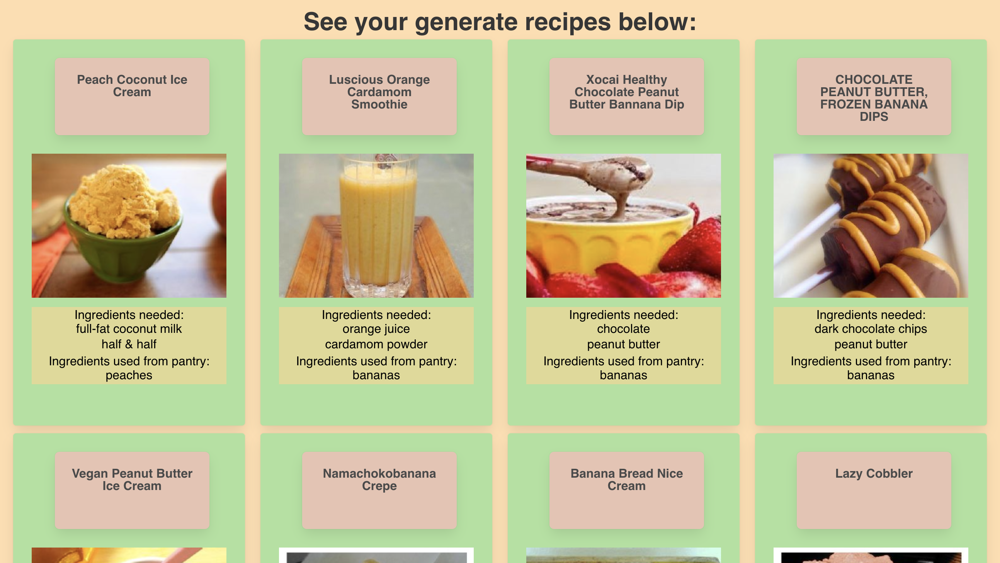

# Dynamic-Cookbook
Dynamic-Cookbook is a food resource designed to help users create delicious meals using the ingredients they already have in their pantry. The app suggests recipes based on pantry. It also suggests recipes that need some additional ingredients so users have various recipe options. Users can also create a shopping list , located on the top-left header, in case they need. 

- We have two modals that consists of increment & decrement button, delete button, local storage & input validation. We used Jquery ajax method to fetch recipes from spoonacular and edamam. 


# Technologies
- HTML
- CSS
- JavaScript
- Jquery
- Granim.js
- Bulma.io
- Spoonacular (API)
- Edamam (API)

# Deployed Link and URL

- https://alenambo02.github.io/dynamic-cookbook/
- https://github.com/alenambo02/dynamic-cookbook

# Significant Code Snippets
API call using Jquery ajax method

``` 
$(document).on("click", "#addItemBtn", function (event) { //Add ingredient listener
    var itemVal = $(this).siblings("input").val()
    if (itemVal != "") { //Simple validation for if any input at all
        var itemCheckUrl = "https://api.edamam.com/auto-complete?app_id=fd3763f8&app_key=4577463150cadf088b2a86813ab799da&q=" + itemVal + "&limit=5"
        $.ajax({ //Fetch validation. Call api to see if an ingredient exsists with the name of the input
            url: itemCheckUrl,
            method: "GET"
        })
            .then(function (response) {
                console.log(response)
                if (response.length > 0) { //Real items will return an array with at least 1 element
                    //console.log("real ingredient")
                    addPantryIngredient(response[0].charAt(0).toUpperCase() + response[0].slice(1))
                } else { //Fake items will return an empty array
                    fakeItemAlert() //Notify user that it is a fake ingredient
                }
            })
    }
})

```

!Ale's note about API call probably goes here!

User story: I want to increase or decrease item quantity

```
function findObjectIndex(name) {
    for (var i = 0; i < ingredientList.length; i++) {
        if (ingredientList[i].name == name) {
            console.log("Found " + name, " at index" + i)
            return i
        }
    }
    return -1
}

function changeCount(name, direction) {
    console.log(name, direction)
    if (direction == "+") {
        ingredientList[findObjectIndex(name)].count += 1
    } else if (ingredientList[findObjectIndex(name)].count > 1) {
        ingredientList[findObjectIndex(name)].count -= 1
    }
    saveIngredientList()
    displayPantryIngredietns()

}
```

This custom built function findObjectIndex is used for function changeCount for increment and decrement. The findObjectindex has a parameter of name (which is an item). Ingredientlist is an array which stores an object. Ingredientlist[i] returns the ingredient object 
.name gets the name from the ingredient object
A for loop to loop through the listed ingredient names 
If ingredient list with index of I name is name then return i 

Function changecount has parameters of name and direction
If the direction is plus then the count of the item in the ingredientlist then it  adds the value and assigns the result to the variable. 
If that’s not the case then, it subtracts the value. 

Like this :


User Story: I want to delete an item if I need to

```
function deleteItemInPantry(name) {
    var i = findObjectIndex(name)
    if (i > -1) {
        ingredientList.splice(i, 1)
    }
    saveIngredientList()
    displayPantryIngredietns()
}
```

The function deleteIteminPantry with parameter of name (aka item) is here to delete (or splice) an item. 
Declared and assigned the var i to the customized find objectindex. 
If i is greater than -1 then splice the ingredientlist 
Same thing happening on shoppingIngredient 

Like this: 


User Story: I want color changing gradient image
- used granim.js here

```
var granimInstance = new Granim({
    element: '#granim',
    direction: 'top-bottom',

    isPausedWhenNotInView: true,
    image: {
        source: './assets/images/food.jpeg',
        position: ['center', 'center'],
        stretchMode: ["stretch-if-smaller", "stretch-if-smaller"],
        blendingMode: 'multiply'
    },
    states: {
        "default-state": {
            gradients: [
                ['#CECECE', '#F2E6DA'],
                // ['#ADD100', '#7B920A'],
                ['#1A2980', '#26D0CE']
            ],
            transitionSpeed: 7000
        }
    }
});

```
Granim.js docs helped me utilize properties like ispaused when not in view, stretchmode, transition speed, direction, position etc to create gradient color changing effects. 

Like this: 


Gif of site at different screen sizes


# Screen Shots for overall Design Highlight





# Gif for Demoing Functionality


# Contributors

- Harshith Manjunatha
- Alejandra Izquierdo 
- Priya Rizal 


# License

- MIT
